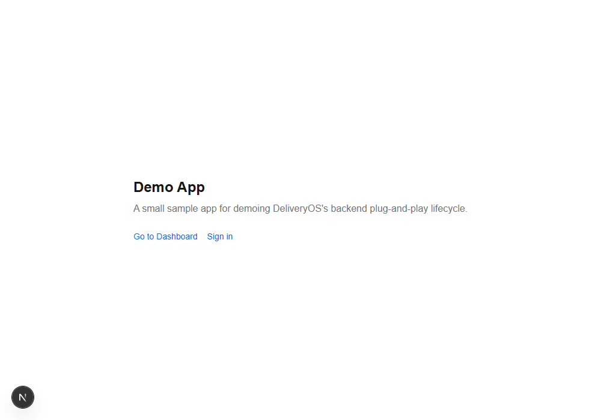

# Live demo script: backend plug-and-play

A presenter's runbook, not a report. If you already know how the UI-component
and starter-kit pulls work, this is the missing third piece: what actually
happens when you pull something that has to *plug into* a real project's
code, not just sit there to be edited.

Everything in this script was run for real while preparing it -- real
email sent, real code typed, real session established, real build broken
and fixed, real merge proposed and applied, real update, real uninstall.
Nothing here is illustrative; every command is one you can actually run.

## Who this is for

Mixed audience: some people in the room will ask "does this actually
work" and want to see a real email land and a real session start.
Others will ask "what's the CI/CD story" and want to see the actual
`deliveryos` commands. This script gives you both, in the same run.

## The three pull types, in one breath

- **UI component** (e.g. a login form) -- a real file, dropped into your
  project, that an AI agent (or you) edits directly. No install step, no
  risk beyond "is this the component I wanted."
- **Starter kit** -- a whole small app, pulled as one unit, meant to be
  built on top of, not merged into something that already exists.
- **Backend plug-and-play** (this demo) -- code that has to *integrate*:
  it touches files that might already exist, needs secrets to actually
  work, and can break your build if it's wrong. That's why it gets its
  own machinery -- signature checks, an auto-wire-and-verify step, an AI
  that proposes fixes/merges instead of guessing, and an audit trail --
  none of which a plain file pull needs.

This demo has two forms, both below: pulling `email-code-auth` alone
into a **project you already have** (the more compelling pitch --
"watch me add real auth to an app you already recognize" -- and the
featured path), or the fuller three-artifact version pulled into a
fresh sample app (`kortix-design-kit` for the dashboard's look,
`kortix-auth-shell` for the login form, `email-code-auth` for the real
wiring) if you want to show the "starter kit + component + backend,
connected" story from nothing instead.

## What you're demoing

- **`email-code-auth`** -- passwordless email login: type your email,
  get a 6-digit code, type the code, you're signed in. No password, no
  database (a stateless, signed code instead of a stored token -- explain
  this if a technical person asks "where's the database"). Two secrets
  (`AUTH_SECRET`, `RESEND_API_KEY`), three files it wires into your
  project (`auth.ts`, `middleware.ts`, the Auth.js API route --
  under `src/` or not, matching whichever convention your project
  already uses). The only one of the three you need for the
  existing-project path.
- **`kortix-auth-shell`** -- a generic login form UI. Only relevant to
  the fresh-sample-app path -- an existing project has its own UI
  already. Pulled separately, as a UI component; its
  `onSendCode`/`onVerifyCode` props get wired to `email-code-auth`'s
  real functions in a small `auth-actions.ts` you (or the agent) write.
- **`kortix-design-kit`** -- the dashboard's actual look (logo, buttons,
  table, avatar). Also only relevant to the fresh-sample-app path. A
  real, already-published `kind: template` artifact -- this is the
  "starter kit" pull; the dashboard is *built* from its components, not
  handed to you finished.
- **The starting point** -- whatever route you're about to protect has
  no guard at all right now -- anyone can load it. That's the opening
  beat, true for either path.

## Add this to a project you already have (the demo you're actually running)

This is the more honest pitch anyway: "watch me bolt real auth onto an
app you already recognize" lands harder than "watch me build a demo app
from nothing." Just `email-code-auth` here -- no `kortix-design-kit`, no
`kortix-auth-shell` -- your existing app already has its own UI; the
plugin only needs somewhere to call from.

### Before you go live: two real checks, not staged ones

**1. Your `tsconfig.json`/`jsconfig.json` `@/*` path alias must match
where the files are about to land.** `email-code-auth`'s wired files
import `@/auth` and `@/lib/auth/...`. DeliveryOS now detects your
project's real convention and writes to the matching location -- root
`auth.ts`/`lib/auth/` if your pages live under root `app/`/`pages/`,
`src/auth.ts`/`src/lib/auth/` if they live under `src/app`/`src/pages`
-- but it does **not** touch your `tsconfig.json`. If your alias says
`"@/*": ["./src/*"]` while your project actually uses root `app/` (or
vice versa), the wiring will compile-error on those two imports even
though every file landed in the right place. Open `tsconfig.json` and
confirm the alias matches your project's real layout before you pull --
this is the exact bug that broke a real rehearsal of this demo, so it's
worth checking live rather than assuming.

**2. Commit or branch first.** This is a real write to a real project --
if the demo goes sideways, you want `git checkout -- .` as your escape
hatch, not a live undo story. This matters even more once you reach the
wiring step below: `deliveryos wire-with-claude` hands off to a real,
tool-enabled `claude` session that can write and run commands across
the whole project, under its own normal permission prompts -- not a
scoped, single-file DeliveryOS write with an automatic rollback the way
a plain pull's own wiring is. `deliveryos remove email-code-auth`
cleans up what the pull itself wired, but a plain `git stash`/fresh
branch before you start is the honest safety net for everything else.

### What's actually different from a fresh project

- **Convention detection still just works** -- your app already has a
  real `app/`/`src/app` (or `pages/`/`src/pages`) directory, so the
  same-project-layout rule applies with no ambiguity to resolve; the
  "Ask Claude where this goes" fallback only exists for a genuinely
  empty scaffold, which your real app isn't.
- **You may hit the merge flow, and that's a *better* beat than the
  clean-pull one.** If your app already has a `middleware.ts` (or
  Next 16's `proxy.ts`) doing something else, the pull won't overwrite
  it -- it flags the file and offers **"Merge with Claude"**, which
  keeps your existing routing and adds the auth guard on top. Worth
  showing off deliberately if your app doesn't already have one:
  `deliveryos wiring email-code-auth --json` (read-only, writes
  nothing) tells you in advance exactly which of the three target files
  already exist, before you commit to pulling.
- **The Configuration tab remembers real values you've already set** --
  if you rehearsed this before and `AUTH_SECRET`/`RESEND_API_KEY` are
  already in `.env.local`, re-pulling doesn't ask you to retype them.
- **Wiring the connection stays in DeliveryOS now, not a manual
  copy-paste** -- a "Wire with Claude →" button in the app (a real
  terminal opens right inside the window), or `deliveryos
  wire-with-claude email-code-auth` on the CLI, covered below. No
  prompt to hand-write, no risk of it referencing a stale path.
- **Detail now opens straight to Configuration.** It's the first tab,
  not something you click over to -- the panel you land on right after
  Pull is the same one you fill in. Connection status sits right above
  the tabs (above the collapsed "How installing this works" panel too),
  so the live `Configured`/`Wired`/`Build` chips are the first thing
  visible, not something you have to scroll to find.

### 0. Build the UI first, with an honest, unimplemented seam -- if you haven't pulled the backend yet

If `kortix-design-kit`/`kortix-auth-shell` are already pulled but
`email-code-auth` isn't yet, build the UI now and leave the backend
connection as a clearly-labeled gap -- not a hardcoded mock -- so
"Wire with Claude" (step 2 below) has something clean to fill in later
instead of a stub it has to detect and remove first.

> **Prompt:** "kortix-design-kit and kortix-auth-shell are already
> pulled into this project. Build:
>
> 1. A /dashboard page using kortix-design-kit's components: a header
>    with the logo, the signed-in user's avatar/email, a sign-out
>    button, and a table below it with a few real-looking rows.
> 2. A /auth page using EmailAuthForm from kortix-auth-shell, in
>    code-only mode (magicLinkEnabled, passwordEnabled={false}).
>
> There is no backend pulled yet, so wire /dashboard and /auth to a
> single, clearly-labeled seam module -- not a hardcoded test code, not
> a fake "always succeeds" mock. The seam's session check returns
> signed-out/null until it's genuinely wired, so /dashboard correctly
> redirects to /auth right now. Name the file something obvious like
> auth-seam.ts, with a comment at the top saying this is the ONLY file
> that needs to change to make this real, and what each function's real
> implementation will eventually call (don't guess at real function
> names -- just describe the shape: "send a code", "verify a code",
> "read the session", "end the session").
>
> Run the build and confirm /dashboard correctly redirects to /auth
> right now (nothing should appear signed-in), then stop -- don't
> attempt to wire a real backend in this same turn."

### 1. Pull the backend -- identical command, real project

**App**: Browse -> search "email-code-auth" -> open the card -> **Pull**.
Fill in `AUTH_SECRET`, `RESEND_API_KEY`, `AUTH_URL` in Configuration.

**CLI**:
```
deliveryos pull email-code-auth --remote <remote>
```

### 2. Wiring it into your app's own UI -- stays fully in DeliveryOS, either way

This used to mean opening a separate editor/Claude Code session and
pasting a hand-written prompt -- a real gap: pull and configure happen
*in* DeliveryOS, then the actual wiring step was a context switch to a
different tool. Fixed two ways, both reusing the exact same underlying
logic:

**In the app**: Detail -> Wiring section -> **"Wire with Claude →"**.
Confirm the safety dialog (it hands off to a real session with real
write access -- make sure your work is committed first), and a real,
interactive `claude` session opens in a terminal embedded right inside
the app window -- no separate window, nothing to copy-paste.

**CLI**:
```
deliveryos wire-with-claude email-code-auth
```

Both paths run the identical real logic underneath (the app's button
literally runs this same CLI command inside a real embedded PTY) --
pick whichever fits how you're driving the demo.

**What this actually does, in order:**
1. Reads this project's real lockfile entry for `email-code-auth` --
   the REAL, already-resolved paths this exact pull produced (`auth.ts`/
   `middleware.ts`, wherever they actually landed -- root or `src/`,
   whichever this project uses), not a hand-typed guess. Writes them to
   `.deliveryos/wire-context-email-code-auth.md`.
2. Hands off to a real, interactive `claude` session, right there in the
   same terminal -- the exact same `claude` you'd run by hand, with its
   own real permission prompts fully intact (this is deliberately NOT an
   unsupervised agent DeliveryOS grants secret write access to -- see
   the note below if a technical person asks why).
3. Tells it to read the context file and wire it in for real: connect
   the real backend to your app's own UI, protect the route that needs
   it, actually call the real functions -- **don't stop at a documented
   seam** -- then confirm the build passes and the real login flow
   works before finishing.
4. Once that session ends (you'll watch it work, same as running Claude
   Code yourself), DeliveryOS runs the real build one more time and
   prints a plain pass/fail summary -- "it didn't just hand off and
   hope."

**If a technical person asks "why not have DeliveryOS just do this
autonomously, headless, no terminal hand-off"**: that was tried once,
for a different feature, and walked back after finding a real Windows
command-injection risk and confirming Claude Code's own tool-restriction
flags aren't reliably enforced. This command deliberately avoids
re-opening that -- it launches the same interactive `claude` you already
trust, under its own normal permission model, rather than trying to
grant a restricted subprocess real write access via flags that don't
reliably hold.

This is genuinely proven, not hypothetical: this exact shape (pull, fix
the tsconfig alias if needed, hand off to a real interactive session)
is what got `email-code-auth` working live in a real existing project
during this fix -- real Resend email, real code, real session, real
sign-out, confirmed in an actual browser.

## Alternative: build this live, from scratch (pull-first, then prompt an agent)

The other way to run this demo -- pulling all three artifacts into a
brand-new sample app instead of an app you already have. Useful if you
don't have a convenient existing project handy, or want to show the
whole "starter kit + component + backend, connected" story in one go.

**Every path below adapts to your project's own convention.** DeliveryOS
checks whether your project uses a root `app/`/`pages/` directory or a
`src/app`/`src/pages` one (the same rule Next.js itself uses) and writes
`email-code-auth`/`kortix-auth-shell`'s files to match -- `auth.ts` and
`middleware.ts` at the root for a plain `create-next-app`, `src/auth.ts`
and `src/middleware.ts` for one scaffolded with `--src-dir`. You never
have to tell it which; a real, confirmed bug earlier meant this used to
be hardcoded to assume `--src-dir` always, silently writing a dead file
in any project that doesn't use it -- fixed, and worth mentioning live if
a technical person asks "what if my project doesn't use `src/`." (On the
rare project where neither convention is detectable yet -- a genuinely
empty scaffold -- Detail's Wiring section offers an "Ask Claude where
this goes ✨" button instead of guessing; same ask-then-confirm shape as
"Merge with Claude" in stage 4 below.)

This is the actual "check first, pull what exists, build the rest" story,
made concrete: three real pulls, then one prompt to an AI agent (Claude
Code, or whatever you use) that actually puts everything just pulled to
use. Every command below was run for real; the prompt is the exact
instruction that produced this sample app.

**A real caveat, confirmed while building this**: a remote's local cache
does not refetch automatically on every CLI call -- if you (or someone
else) just pushed a new artifact, `deliveryos pull` may still see the
old catalog until it's refreshed. In the app, that's the Browse view's
**Refresh** button; there's no CLI equivalent yet. Do this once before
you go on, not mid-demo.

**A note before you start, since you're driving this from the app**: the
app has exactly two AI-assist buttons, and neither one appears during a
plain, clean pull like the three below. **"Merge with Claude"** only
shows up in the Wiring section when a target file *already existed*
with different content before you pulled (stage 4 of the lifecycle
script, further down). **"Want help fixing this? ✨"** only shows up
after a pull's own build-verify step actually fails. A fresh pull into
a clean project -- exactly what steps 1-3 below are -- triggers neither;
that's expected, not a sign something's missing. The only *prompting*
in this whole build-from-scratch flow happens in step 4, in your editor
(Claude Code or whatever you use), not in the DeliveryOS app itself.

**Pull all three before prompting for anything.** An earlier version of
this doc pulled the UI first and prompted for `/auth` before the backend
existed -- a real rehearsal run showed what that actually causes: a
capable agent, told to build a page whose callbacks have nothing to call
yet, reasonably built a temporary stub (a hardcoded test code) to make
the UI testable. Nothing wrong with that instinct, but it's a second
piece of state a later prompt then has to know to find and remove --
exactly the kind of thing that goes stale. Pulling all three first means
every prompt below is written against a project where the real backend
already exists, so there's never a reason for an agent to invent one.

### 1. Pull the UI kit -- the "starter kit" pull

**App**: Browse -> search "kortix-design-kit" -> open the card -> **Pull**
(top-right of Detail).

**CLI**:
```
deliveryos pull kortix-design-kit --remote ai-helpers
```

Lands a whole real design system at `kortix-design-kit/` (Suna's own
tokens + ~30 components, each with a live preview) -- nothing to wire,
just there to build with. No Configuration tab, no wiring section --
this artifact declares neither `install_params` nor `wiring_actions`,
so Detail only ever shows Design/Components/Documentation for it.

### 2. Pull the login UI

**App**: Browse -> search "kortix-auth-shell" -> open the card -> **Pull**.

**CLI**:
```
deliveryos pull kortix-auth-shell --remote <remote>
```

A real, generic staged email-code login form.

### 3. Pull the backend -- this is the one that wires itself

If your project uses `--src-dir`, this lands under `src/`; a plain
`create-next-app` (no `--src-dir`) gets it at the root instead --
DeliveryOS detects which and adapts automatically (see the callout
above).

**App**: Browse -> search "email-code-auth" -> open the card -> **Pull**.
Detail opens straight onto Configuration (it's the first tab now) --
fill in `AUTH_SECRET`, `RESEND_API_KEY`, `AUTH_URL`, click **Save**.
Wiring applies automatically the moment you pull (before you even fill
the form); the Connection-status panel above the tabs shows live
`Configured`/`Wired`/`Build` chips once you have.

**CLI**:
```
deliveryos pull email-code-auth --remote <remote>
```

Auto-writes `auth.ts`, `middleware.ts`, and the Auth.js API route (under
`src/` or at the root, matching your project); asks for
`AUTH_SECRET`/`RESEND_API_KEY`/`AUTH_URL`. Nothing to prompt for here,
in the app or otherwise -- this step is the automatic one, worth
pausing on to say so out loud.

### 4. One prompt, building everything wired for real from the start

There is no app button for this step. This is real, project-specific
code, written in your editor (Claude Code or whichever agent you use)
against the three things you just pulled -- not a DeliveryOS action.

> **Prompt:** "Three things were just pulled into this project:
> `kortix-design-kit/` (a component library), `kortix-auth-shell`
> (a generic email-code sign-in form, wherever it actually landed --
> `features/kortix-auth-shell/` or `src/features/kortix-auth-shell/`,
> check which), and `email-code-auth` (a real, already-wired passwordless
> email-code backend -- `auth.ts`/`middleware.ts` plus a `lib/auth/`
> folder, wherever those actually landed -- `generateLoginCode`/
> `sendCodeEmail` send and verify a code, Auth.js's `signIn`/`signOut`
> handle the session).
>
> Build a `/dashboard` page from the design kit's components (header with
> logo, signed-in user's avatar/email, sign-out button; a table below
> it), and a `/auth` page using `EmailAuthForm` in code-only mode, wired
> directly to the real backend functions above -- not a placeholder, not
> a hardcoded test code. The backend already exists; there's no reason
> to mock it. **Actually call the real functions now, in this same
> turn -- don't stop at documenting what the real implementation would
> be in a comment, and don't leave an intermediate seam/interface
> unfilled for later.** Confirm the dashboard route is actually
> protected and that sign-out actually ends the session, then run the
> build, then walk the real login flow yourself (a real code, a real
> session, `/dashboard` actually reachable) before calling it done."

A real coding agent reads all three pulled things and wires them
correctly on its own -- you don't need to name every prop or function
for it (confirmed: this is genuinely how this sample app was built).
What actually matters is the ordering above: prompting for the whole
loop only once the real backend already exists removes the one
condition that produces a stub in the first place.

**Why this step can't be a `wiring_action` no matter how DeliveryOS
evolves**: `wiring_actions` work because Auth.js itself defines fixed,
known file paths (`src/middleware.ts`, that exact API route) -- the
same every time, for every project. But "which UI callback calls which
backend function" depends on which two *specific* artifacts you
happened to pull together, in your specific project -- a different UI
kit, a different callback shape, a different dashboard layout each
time. There's no fixed convention to write a `wiring_action` against.
That's the actual division of labor: DeliveryOS automates the part
that's identical every time (steps 1-3, zero prompting for step 3); an
agent handles the part that's different every time (step 4), by reading
the real code it just pulled.

## Pre-demo checklist (do this before anyone's watching)

1. **A real Resend API key** in `.env.local` (`RESEND_API_KEY=...`,
   `AUTH_SECRET=` a real random value, `AUTH_URL=http://localhost:<port>`
   matching whatever port you actually run on -- a mismatch here makes
   sign-in silently redirect to the wrong place).
2. **Know your test email.** Resend's sandbox sender
   (`onboarding@resend.dev`) can send to your own verified Resend account
   email, or to `delivered@resend.dev` (always "succeeds," but you can't
   read that inbox -- fine for the mechanical parts, not for "watch a
   real email land in my real inbox"). If you want the audience to see a
   real inbox, verify a domain beforehand or use your own address.
3. **A second, already-wired copy of `email-code-auth`'s manifest at a
   bumped version** (e.g. `1.0.1`, a real small copy change) sitting on
   whatever remote you're pulling from, ready for the Update beat --
   don't try to author this live.
4. **Decide your remote.** `kortix-design-kit` is real, already on
   `growtharc-ai-helpers`. `email-code-auth` and `kortix-auth-shell`
   were built and verified against a local test git remote; pushing
   either for real is a separate, deliberate step (see the CLI
   cheat-sheet for what that looks like once they're there).
5. Have a terminal AND the app open side by side -- several beats below
   show the same action both ways.
6. Reset to pristine, pre-pull state right before you go on: no
   `auth.ts`, `middleware.ts`, `app/api/auth/`, or `lib/auth/` (at the
   root or under `src/`, whichever your project uses).
   (`deliveryos remove email-code-auth` does this cleanly if it's
   currently pulled.) If you're doing the full from-scratch build
   (the "Alternative" section), also remove `kortix-design-kit/` and
   `kortix-auth-shell`'s own folder (`features/kortix-auth-shell/` or
   `src/features/kortix-auth-shell/`). If you're demoing on an existing
   project, this is also the moment to check the `tsconfig.json` alias
   and commit/branch -- see the two real checks above.

## Starting state: show this first

Load the app, go to whichever route you're about to protect (the
sample app's `/dashboard` if you're running the from-scratch
alternative; your own real unprotected route if you're adding this to
an existing project). It just... loads. Nothing stops you.

> "This is a real page in a real app. Right now, anyone who finds this
> URL can see it. Let's fix that -- live, not with slides."



## The script, stage by stage

### 1. Install -- signature check, then a plain config form

Pull `email-code-auth`. If it's signed (a real catalog entry would be),
the signature is verified *before any file lands* -- a tampered or
unsigned-when-it-shouldn't-be artifact never gets the chance to write
anything. Then you're asked for what it needs, through a plain form
(app) or `--set` flags (CLI) -- never a config file to hand-edit.

**App**: Browse -> `email-code-auth` -> Pull. Fill in `AUTH_SECRET` /
`RESEND_API_KEY` in Configuration.

**CLI**:
```
deliveryos pull email-code-auth --remote <your-remote>
```

> "Before this touches a single file, DeliveryOS checks that it's really
> what it claims to be. Then it just asks you for two values -- not a
> `.env` file to write by hand."

### 2. Wire in -- new files, auto-applied, build checked immediately

Because none of the three target files exist yet, all three get written
automatically, and the project's real build runs right after -- not
"trust me," an actual `next build`.

Real output from this exact run (a `--src-dir` project -- a plain
`create-next-app` project shows the same message with `lib/auth`
instead, no `src/` prefix):
```
Pulled "email-code-auth" -> .../src/lib/auth
Wiring was applied automatically to 3 files. The build passes.
There's nothing else to do.
```

> "It didn't just drop files in and hope. It rebuilt the actual project
> and confirmed nothing broke, in the same step."

### 3. If a change breaks your build

Pull normally, then deliberately break one of the freshly-wired files
(a stray character is enough) to show the recovery path live -- this is
the one beat worth staging, since a real accidental break is unlikely to
happen on cue.

**App**: after a broken build, a "Want help fixing this? ✨" offer
appears next to the failing file. Click it, review the proposed fix,
Apply.

**What happens underneath** (say this after clicking Apply): the fix is
written, the build runs again for real, and if it *still* doesn't pass,
your original file is put back automatically -- you're never left with a
half-applied, broken change.

Real confirmed outcome from this exact run: a genuinely broken
`src/auth.ts` -> a proposed fix -> applied -> rebuild passes.

### 4. If a file already exists -- a real merge, not an overwrite

Stage this one too: before pulling, put a *different*, real
`middleware.ts` in place (pretend an earlier plugin already wired it).
Pull again -- this file is now flagged "needs a manual look" instead of
being silently overwritten or silently skipped.

**App**: Wiring section -> "Merge with Claude" on the flagged file.
Review the proposed merge (it keeps your existing code and adds only
what's needed), Apply.

Real confirmed outcome: an existing `middleware.ts` protecting `/admin`
merged cleanly into protecting `/admin` *and* `/dashboard`, verified by
a real rebuild, with the original content preserved everywhere it wasn't
touched.

> "It didn't guess. It read what was actually there and proposed adding
> to it -- and it would have told us honestly if the two couldn't
> coexist, instead of forcing a bad merge."

### 5. After install -- one plain-language summary

No wall of logs. One line covering what worked and what's still on you
(a missing config value, a file that needs review) -- shown as a toast
right after pulling, and available any time after in Detail as a
persistent "Connection status" panel with live chips (Configured,
Wired, Build) -- it sits right at the top of the Detail view, above the
"How installing this works" panel, so it's the first thing you see
when you reopen it.

### 6. Audit -- everything proposed is recorded

Open the Activity tab. Every proposal from steps 3 and 4 is there,
labeled `BUILD FIX` or `MERGE`, each with a real before/after you can
expand -- whether it was kept or rolled back.

> "Nothing an AI proposed here happened invisibly. It's all sitting
> right here, per artifact, any time you want to check."

### 7. Uninstall -- one clean command

**App**: Remove button on the artifact's Detail page.

**CLI**:
```
deliveryos remove email-code-auth
```

Real output (a `--src-dir` project -- a plain `create-next-app` project
lists the same three files without the `src/` prefix):
```
Removed "email-code-auth":
  Install directory: deleted
  Wired files deleted: src/auth.ts, src/middleware.ts, src/app/api/auth/[...nextauth]/route.ts
  Pristine snapshot: deleted
  Lockfile entry: removed

Needs your attention -- not touched automatically:
  .env.local still has value(s) for: AUTH_SECRET, RESEND_API_KEY, AUTH_URL
```

> "It cleans up exactly what it added -- and tells you, plainly, the one
> thing it's leaving alone on purpose (your secrets, in case something
> else still needs them) instead of silently deleting them."

### 8. Secrets -- never silently exposed

Stage this by removing the `.env*` line from `.gitignore` first. Then
rotate or set any secret value (step 9). The warning fires immediately,
every time -- it's not a one-time check.

Real output:
```
DeliveryOS just wrote a real secret value into .env.local, but it does
not look like .gitignore covers that file -- if this project is
committed to git, that secret could get pushed to a shared remote. Add
".env.local" (or ".env*.local") to .gitignore.
```

### 9. Rotate a secret -- from Configuration or the CLI

**App**: Detail -> Configuration -> edit the value -> Save. No re-pull.

**CLI**:
```
deliveryos config email-code-auth --set RESEND_API_KEY=<new-value>
```

Note the honest caveat in the real output: *"this does not re-run
wiring_actions -- only code that reads `process.env` at runtime will see
the new value"* -- worth reading aloud if anyone's technical enough to
ask "does this restart anything."

### 10. Reconfigure -- the form remembers you

Close and reopen Configuration. Already-set values are still there,
pre-filled -- you're never re-typing something you already gave it
(this used to be a real bug; it's fixed).

### 11. Update -- applies for real, not just "new version available"

With a bumped version staged on the remote (pre-demo checklist item 3):

```
deliveryos check-updates
  email-code-auth (<remote>): 1.0.0 -> 1.0.1

deliveryos check-updates --apply
  email-code-auth (<remote>): updated 1.0.0 -> 1.0.1
```

Mention, don't necessarily demo live: applying a real update deletes
files the new version removed, and *refuses* -- rather than guessing --
if you've made local edits it can't safely reconcile.

### 12. Timeouts -- a hang isn't mistaken for "it broke"

Stage the fast half live: point `package.json`'s `build` script at a
nonexistent binary, then verify. Real output:
```
Build command's tool was not found on this machine's PATH:
...
'totally-nonexistent-build-tool-xyz' is not recognized as an internal
or external command, operable program or batch file.
```

Describe, don't wait out live: a genuinely hung build/install command is
killed automatically after 5 minutes and reported as *timed out* --
worded differently from a real failure, and differently again from a
missing tool, so you're never left guessing which of the three actually
happened.

## If something doesn't cooperate live

Screenshots from this exact run, in order, as a fallback:

1. `images/backend-plugin-demo-script/1-home.png` -- the unguarded starting state
2. `images/backend-plugin-demo-script/2-auth-entry.png` -- the pulled-in sign-in form
3. `images/backend-plugin-demo-script/3-auth-code-step.png` -- the code step, right after a real email send

For the deeper technical reference behind any of this, see
[`backend-plugin-lifecycle.md`](backend-plugin-lifecycle.md) (the full
mechanism, file by file) and
[`backend-plugin-walkthrough.md`](backend-plugin-walkthrough.md) (a
screenshot tour of the original `nextauth-credentials` run).

## CLI cheat-sheet

```
deliveryos remote add <git-url> [--name <name>]
deliveryos list [--remote <name>]
deliveryos pull <id> [--remote <name>] [--set KEY=VALUE ...] [--no-wire]
deliveryos config <id> [--remote <name>] --set KEY=VALUE [--set KEY=VALUE ...]
deliveryos wiring <id> [--remote <name>] [--json]      # read-only, never writes
deliveryos wire-with-claude <id> [--remote <name>]     # hands off to a real claude session
deliveryos check-updates [--apply]
deliveryos remove <id>

# the three real pulls behind this exact demo:
deliveryos pull kortix-design-kit --remote ai-helpers
deliveryos pull kortix-auth-shell --remote <remote>
deliveryos pull email-code-auth --remote <remote>
```

The two AI-assisted flows in the app (build-fix, merge) are deliberately
app-only and read-only-until-confirmed -- propose a single bounded file
change, a human clicks Apply, DeliveryOS verifies and auto-rolls-back on
failure. `wiring` (no `-with-claude`) mirrors that read-only posture on
the CLI: it never writes anything. `wire-with-claude` is different on
purpose -- a genuinely new class of command, the only one in this CLI
that hands off to a real, unrestricted interactive agent rather than a
scoped, single-file AI assist. See "two real checks" above before using
it on a project you care about.

Remote cache staleness (confirmed while building this): after pushing or
committing a new artifact to a remote, `deliveryos pull`/`list` may still
show the old catalog until it's refreshed -- the app's Browse view
**Refresh** button does this; there's no CLI equivalent today.
