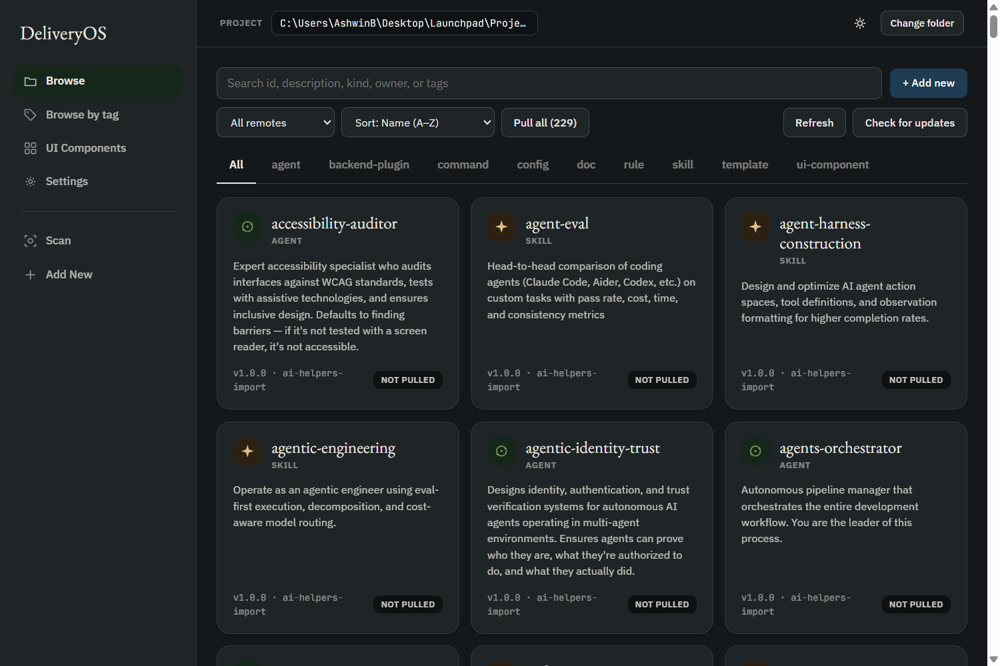
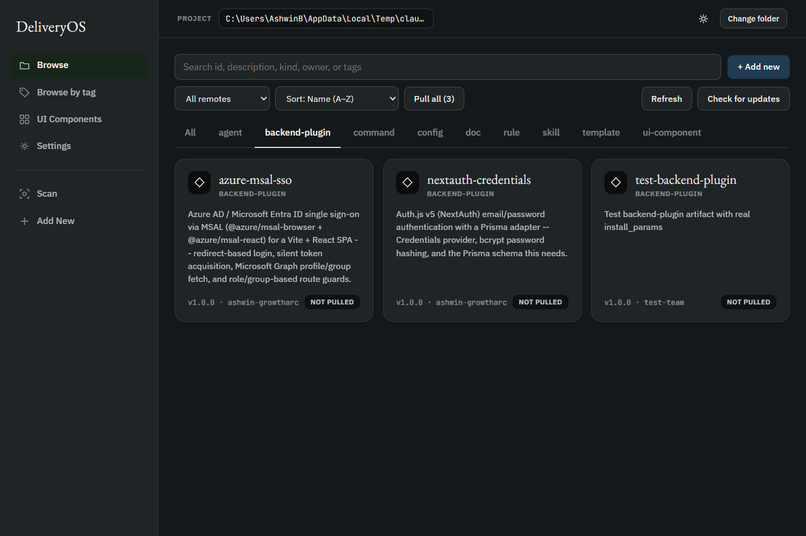
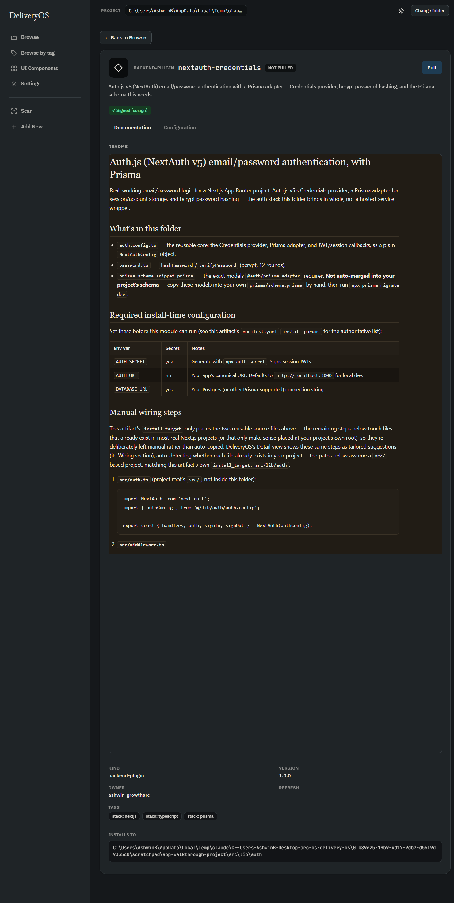
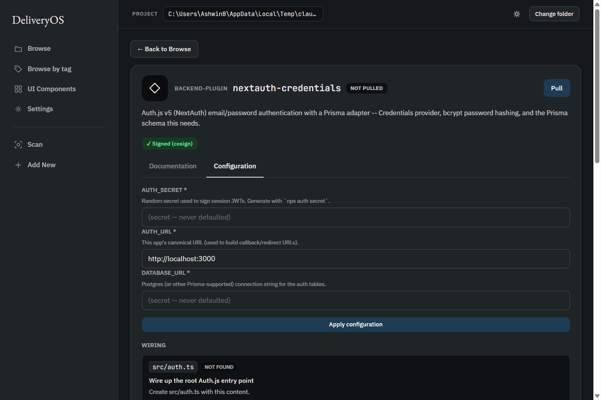
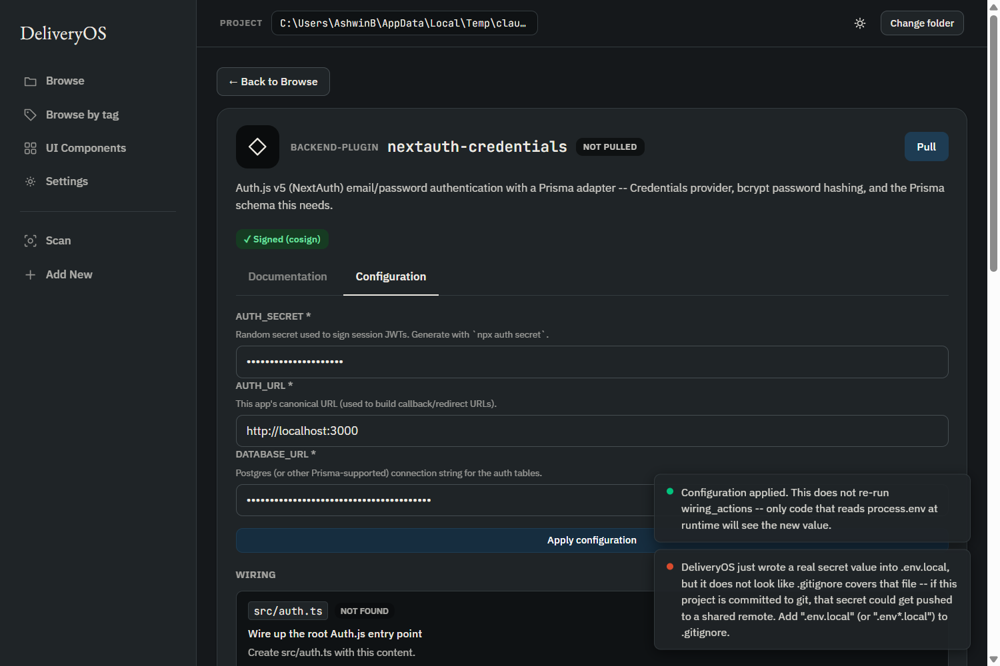
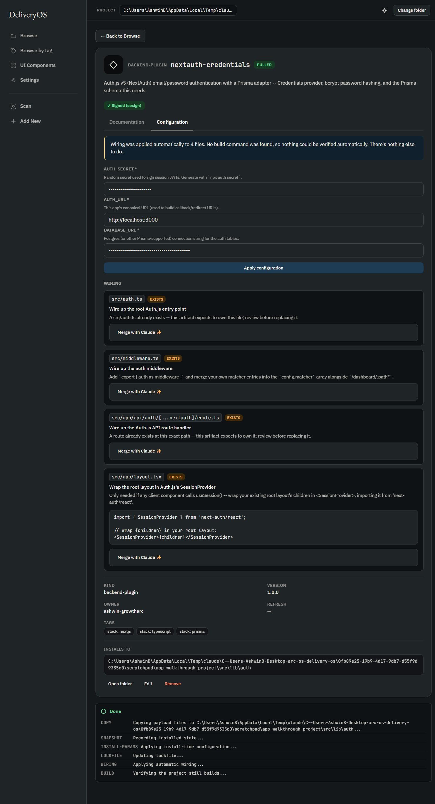
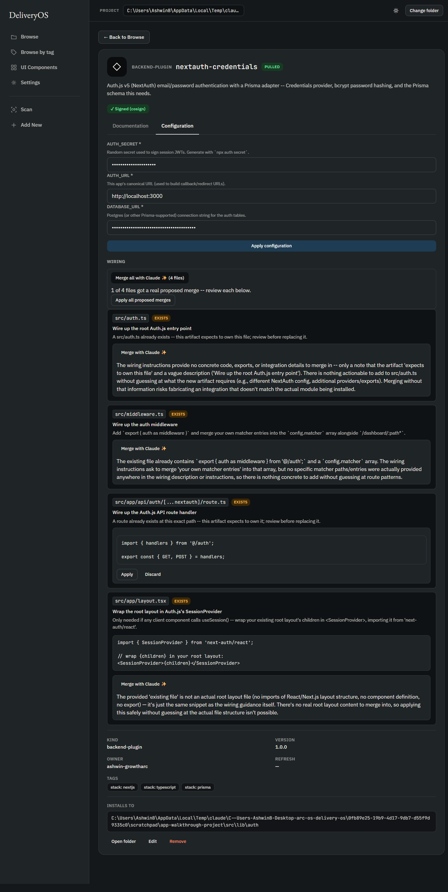
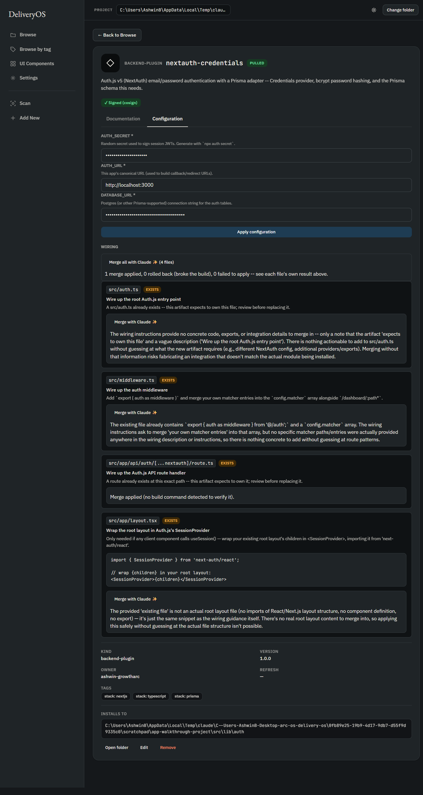
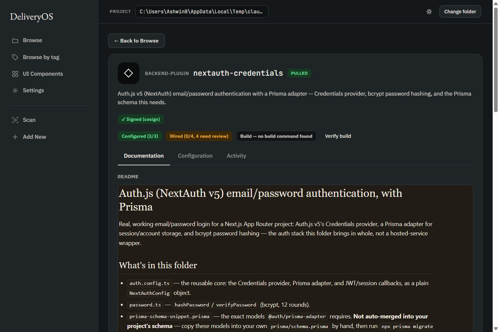

# Backend plugin walkthrough: `nextauth-credentials`, in the real app

Every screenshot below is real — the actual DeliveryOS desktop app, driven
end to end against the real `nextauth-credentials` artifact (Auth.js v5 +
Prisma email/password login) from the `ai-helpers` remote, pulled into a
genuinely empty scratch project. Nothing here is mocked or staged.

See [README.md](../README.md) for the CLI reference and
[ARCHITECTURE.md](../ARCHITECTURE.md) for how `backend-plugin` fits into
the rest of the artifact model. This doc is just the walkthrough.

## Step 1 — Browse the catalog

The real catalog: 230 artifacts across every registered remote, filterable
by kind.



## Step 2 — Filter to `backend-plugin`



## Step 3 — Open it, read the real docs

Clicking into `nextauth-credentials` shows its actual rendered `README.md`
— the same file that ships in the payload, including the real
`install_params` table and the manual wiring steps prose. The green
**Signed (cosign)** badge is a real, verified signature, not decoration.



## Step 4 — The Configuration tab

Switching to Configuration shows the real form generated from this
artifact's own declared `install_params` — two secrets with no default,
one URL with a real default already filled in. Below it, the **Wiring**
section already shows, before anything is pulled, exactly which files this
artifact would touch and what it would do to each one.



## Step 5 — Fill it in and apply

After typing real values and clicking **Apply configuration**, two real
toasts appear: confirmation that the values were written, and the same
`.gitignore` safety warning the CLI prints — this is a genuinely empty
project with no `.gitignore` yet, so DeliveryOS says so plainly instead of
silently leaving a secret one `git add .` away from a shared remote.



## Step 6 — Pull, and everything else happens on its own

Clicking **Pull** runs the real, current default flow: the payload is
copied, a pristine snapshot is recorded, install-time config is applied,
the lockfile is updated, `wiring_actions` are applied automatically, and
the project's own build is re-verified — all visible in the progress log
at the bottom.

The badge flips to **PULLED**, and a plain-language summary banner
appears: *"Wiring was applied automatically to 4 files. No build command
was found, so nothing could be verified automatically. There's nothing
else to do."* Every wiring card below now shows **EXISTS** — since all
four target files didn't exist a moment ago, got auto-written, and now
genuinely do — with **Merge with Claude** offered for any further edit.



## Bonus — "Merge all with Claude" for the files that already existed

All four target files above happened to already exist in this run (a
genuinely fresh project has nothing to merge against, so they were all
auto-written) — a real chance to test the batch version of "Merge with
Claude" against all four at once instead of clicking it four times.

**Asking** for all four, sequentially (one real `claude` subprocess call
per file, never run concurrently): three came back with an honest refusal
— *"there is nothing actionable to add... merging without that
information risks fabricating an integration that doesn't match the
actual module being installed"* — and one (the API route handler) got a
real proposed merge.



**Applying** the one real proposal (still one explicit human click, just
covering every file that click applies to): the merge landed, the audit
log recorded it, and the aggregate result was reported plainly —
`1 merge applied, 0 rolled back, 0 failed to apply`.



This is the same underlying `requestWiringMerge`/`applyWiringMerge`
engine calls the single-file button already used — "Merge all" only
orchestrates them across every file at once; it's not a second,
independently-behaving code path.

## Bonus — "is this actually connected?" any time you come back

Everything above (the plain-language summary, the toasts) is tied to the
moment right after a pull — close the app and reopen this artifact
tomorrow, and none of that is still on screen. The **Connection status**
panel is the persistent version: recomputed fresh every time Detail
opens, straight from the real project on disk — not memory of what
happened last time.



**Configured (3/3)** and **Wired (0/4, 4 need review)** are read live from
`.env.local` and the real wiring resolution — this project's four target
files all genuinely exist (one from an earlier real merge, three from the
original auto-wire), so all four correctly show as needing a look, not
just the ones DeliveryOS itself hasn't already reviewed. **Build** is
deliberately *not* run automatically just from opening this page — a real
build isn't free, and this view can be opened far more often than a pull
happens — so it starts at "not checked yet" and only runs when you click
**Verify build**.

## What actually landed on disk

Confirmed directly on the filesystem after this run — nothing here is
inferred from the UI alone:

```
.env.local                                    -- real secret values, never in the payload
.env.example                                   -- safe, blank placeholders
src/auth.ts                                    -- written automatically
src/middleware.ts                              -- written automatically
src/app/api/auth/[...nextauth]/route.ts        -- written automatically
src/app/layout.tsx                             -- written automatically
src/lib/auth/auth.config.ts                    -- the artifact's own payload
src/lib/auth/password.ts
src/lib/auth/prisma-schema-snippet.prisma      -- Tier 3: merge by hand, on purpose
src/lib/auth/README.md
```

## Reproduce it yourself

```bash
mkdir my-test-project && cd my-test-project
deliveryos remote add https://github.com/ashwin-growtharc/growtharc-ai-helpers.git --name ai-helpers   # skip if already registered
npx tauri dev   # from src-tauri/, or use a packaged build
```

Then: **Change folder** → pick `my-test-project` → filter to
`backend-plugin` → open `nextauth-credentials` → fill in Configuration →
**Pull**.
